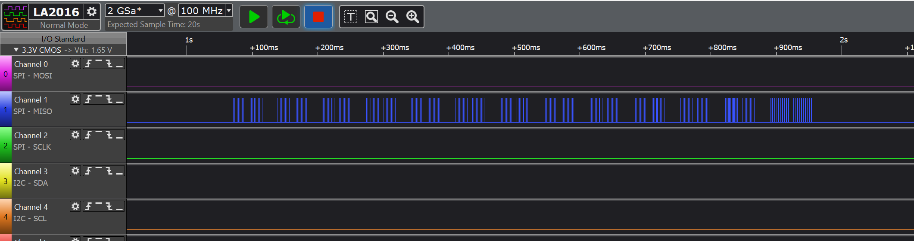
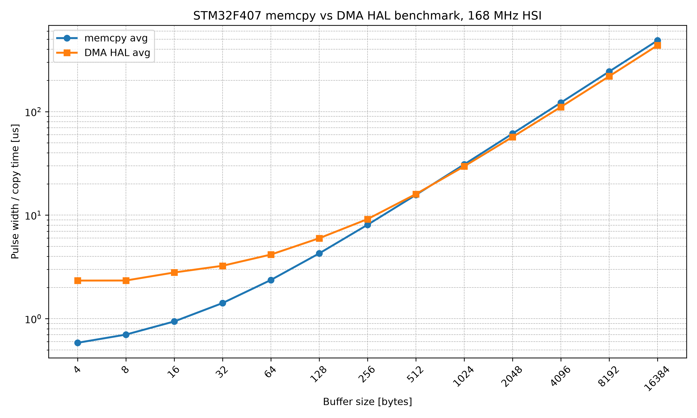

# Bare Metal Training 02: Memcpy vs DMA Benchmark

This project investigates and compares the execution speed of CPU-driven memory copying using `memcpy()` against Direct Memory Access (DMA) memory-to-memory transfers on the STM32F407VGT6 microcontroller.

## Goal

The goal is to measure copy time for different buffer sizes from 4 bytes to 16384 bytes and determine the approximate crossover region where DMA becomes more efficient than `memcpy()`.

## Measurement Method

The benchmark uses the internal DWT cycle counter (`DWT->CYCCNT`) to measure execution time in CPU cycles.

DMA transfers are measured using polling instead of interrupts. This avoids interrupt handling overhead and provides deterministic timing measurements for benchmarking.

For each buffer size, both `memcpy()` and DMA HAL transfers are executed exactly **10 times** to gather minimum and average values. 

UART output is triggered only after completing all iterations for a given size, ensuring that serial transmission does not distort the measured copy time.

## Hardware Setup

- **MCU:** STM32F407VGT6
- **System Clock:** 16 MHz (HSI) and 168 MHz (PLL from HSI)
- **DMA Configuration:** Memory-to-Memory, DMA2 Stream 0, Channel 0
- **DMA Data Width:** 8-bit / Byte
- **Internal Measurement:** `DWT->CYCCNT` cycle counter
- **External Verification:** Kingst LA2016 logic analyzer
- **Data Export:** UART (115200 baud)


**Figure 1. Hardware setup with STM32F407 Discovery board, GlobalLogic shield and Kingst LA2016 logic analyzer.**

## External Verification (Logic Analyzer)

To verify hardware timing and ensure measurement loop integrity, a Kingst LA2016 logic analyzer was used with the following setup:
* **GND:** Connected to the logic analyzer ground.
* **PE5:** (Measurement pin) toggled high during the operation and connected to Channel 0.

The captured pulse widths confirm the real hardware timing of each transfer method. These traces provide the raw measurement evidence for the benchmark timeline.



**Figure 2. Kingst LA2016 capture showing repeated GPIO pulses generated during the benchmark execution.**

The captured raw data traces are available as `.csv` files in the `docs/results/` directory. These CSV files contain exactly 260 pulses per benchmark run (13 sizes × 2 methods × 10 repeats).

## Benchmark Results & Analysis

The benchmark was executed at two different system clock frequencies:
- **16 MHz HSI** — validation run
- **168 MHz PLL from HSI** — final benchmark run

This allows checking both the measurement pipeline and the final high-frequency behavior of the STM32F407 memory subsystem.

### 1. Results at 16 MHz HSI


**Figure 3. Performance comparison at 16 MHz HSI.**

At 16 MHz, the DMA HAL setup overhead is clearly visible for small buffer sizes.
- **Small buffers:** `memcpy()` is significantly faster.
- **Around 1024 bytes:** Both methods become very close in execution time.
- **From 2048 bytes and above:** DMA HAL becomes faster.

This run was mainly used to validate the measurement pipeline: DWT timing, UART output, GPIO pulse generation and Kingst LA2016 capture.

### 2. Results at 168 MHz PLL from HSI



**Figure 4. Performance comparison at 168 MHz PLL from HSI.**

At 168 MHz, both methods become much faster in real time. The benchmark is affected by Flash wait states (5 WS), ART Accelerator behavior, HAL software overhead and AHB bus timing.
- **Up to 512 bytes:** `memcpy()` is faster.
- **Around 512–1024 bytes:** Transition/crossover region.
- **From 1024 bytes and above:** DMA HAL becomes faster.

The final 168 MHz benchmark serves as the primary result for this report.

## Output Format

The firmware outputs the results via UART in CSV format:

```csv
Size,Memcpy_Min,Memcpy_Avg,DMA_HAL_Min,DMA_HAL_Avg
4,...
8,...
16,...
...
16384,...
```


## Raw Data

Raw logic analyzer CSV files are stored in:

```
docs/results/
```

Files:

- `16MHz.csv`
- `168MHz.csv`

These files contain the exported Kingst LA2016 pulse captures and can be used to regenerate the charts.

## Conclusion

The benchmark confirms the expected behavior:

- `memcpy()` is faster for small buffers because DMA HAL has a fixed setup overhead.
- The crossover region is around 512–1024 bytes.
- From approximately 1024 bytes and above, DMA HAL becomes faster in the final 168 MHz benchmark.

Therefore, `memcpy()` is preferable for small memory blocks, while DMA is more efficient for larger memory transfers.